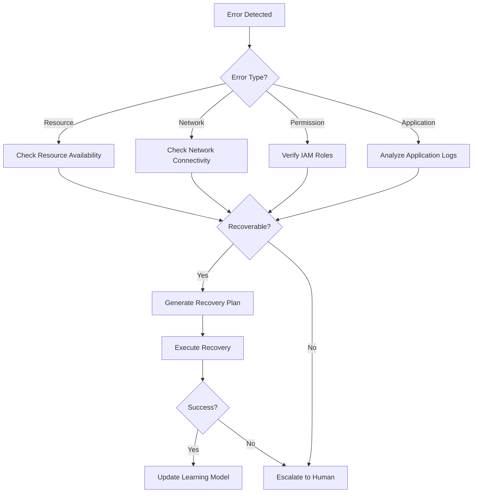

# AI統合機能設計書

## 概要
bunsuiのAI統合機能は、AIエージェントがCLIを通じてデータパイプラインの監視・管理・復旧を行えるようにすることで、人間とAIの協調作業を実現します。

## 設計方針

### 1. AI-Friendly CLI設計
- 構造化された出力（JSON/YAML）
- 明確なエラーメッセージとエラーコード
- 予測可能なコマンド体系
- ステートレスな操作

### 2. セキュリティ考慮
- 読み取り専用モードのサポート
- 操作の監査ログ
- 承認フローの組み込み
- ロールベースアクセス制御

## AI向けCLIコマンド体系

### 基本コマンド構造
```bash
bunsui [global-options] <resource> <action> [action-options]
```

### リソースタイプ
- `session` - セッション管理
- `pipeline` - パイプライン操作
- `job` - ジョブ管理
- `error` - エラー分析

## 主要コマンド仕様

### 1. ステータス確認コマンド

```bash
# セッション一覧取得
bunsui session list --format json --filter status=failed

# 出力例
{
  "sessions": [
    {
      "session_id": "ses-123456",
      "pipeline_id": "pipe-abc",
      "status": "failed",
      "failed_jobs": ["job-003", "job-005"],
      "created_at": "2024-01-10T10:00:00Z",
      "error_summary": "ECS task failed to start"
    }
  ]
}
```

### 2. エラー分析コマンド

```bash
# エラー詳細取得
bunsui error analyze --session-id ses-123456 --format json

# 出力例
{
  "session_id": "ses-123456",
  "errors": [
    {
      "job_id": "job-003",
      "operation_id": "op-ecs-001",
      "error_code": "ECS_TASK_FAILED",
      "message": "Task failed to start: insufficient memory",
      "timestamp": "2024-01-10T10:15:00Z",
      "context": {
        "task_definition": "data-processor:v2",
        "cluster": "prod-cluster",
        "required_memory": 4096,
        "available_memory": 2048
      },
      "recovery_suggestions": [
        {
          "action": "increase_memory",
          "confidence": 0.95,
          "command": "bunsui job update-config job-003 --memory 8192"
        },
        {
          "action": "retry_with_smaller_batch",
          "confidence": 0.80,
          "command": "bunsui job rerun job-003 --batch-size 500"
        }
      ]
    }
  ]
}
```

### 3. リラン実行コマンド

```bash
# ジョブのリラン
bunsui job rerun job-003 --session-id ses-123456 --skip-successful

# セッション全体のリラン
bunsui session rerun ses-123456 --from-job job-003 --strategy checkpoint

# 出力例
{
  "rerun_id": "rerun-789",
  "original_session_id": "ses-123456",
  "strategy": "checkpoint",
  "skipped_jobs": ["job-001", "job-002"],
  "jobs_to_run": ["job-003", "job-004", "job-005"],
  "status": "initiated",
  "estimated_duration_minutes": 45
}
```

### 4. 対話型復旧支援

```bash
# AI向け復旧プラン生成
bunsui recovery suggest --session-id ses-123456

# 出力例
{
  "session_id": "ses-123456",
  "recovery_plans": [
    {
      "plan_id": "plan-001",
      "description": "Retry failed jobs with increased resources",
      "success_probability": 0.85,
      "estimated_time_minutes": 30,
      "steps": [
        {
          "step": 1,
          "action": "update_config",
          "command": "bunsui job update-config job-003 --memory 8192",
          "reason": "Previous failure due to insufficient memory"
        },
        {
          "step": 2,
          "action": "rerun",
          "command": "bunsui session rerun ses-123456 --from-job job-003",
          "reason": "Execute from failed job with new configuration"
        }
      ],
      "risks": [
        "Increased cost due to higher memory allocation",
        "Potential impact on other running jobs"
      ]
    }
  ]
}
```

## AI協調機能の実装

### 1. エラーパターン学習

```python
# core/ai/error_analyzer.py
class ErrorAnalyzer:
    """エラーパターンの分析と学習"""
    
    def analyze_error(self, error_context: dict) -> ErrorAnalysis:
        """エラーコンテキストから原因を分析"""
        # エラーコードのマッピング
        # 過去の類似エラーの検索
        # 復旧方法の提案
        pass
    
    def learn_from_resolution(self, error_id: str, resolution: dict):
        """成功した復旧方法を学習"""
        # 解決パターンをDynamoDBに保存
        # 成功率の更新
        pass
```

### 2. 自動復旧エンジン

```python
# core/ai/recovery_engine.py
class RecoveryEngine:
    """自動復旧の実行エンジン"""
    
    def generate_recovery_plan(self, session: Session) -> RecoveryPlan:
        """セッションの状態から復旧計画を生成"""
        # エラー分析
        # 依存関係の考慮
        # リソース制約の確認
        # 最適な復旧戦略の選択
        pass
    
    def execute_recovery(self, plan: RecoveryPlan, dry_run: bool = True):
        """復旧計画の実行"""
        # ドライラン機能
        # 段階的実行
        # ロールバック機能
        pass
```

### 3. AIエージェント向けAPI

```python
# cli/ai_interface/api.py
class AIInterface:
    """AI エージェント向けの高レベルAPI"""
    
    async def monitor_pipelines(self) -> AsyncIterator[PipelineEvent]:
        """パイプラインの状態をストリーミング"""
        # WebSocket or Server-Sent Events
        # リアルタイムイベント通知
        pass
    
    def execute_command(self, command: str, require_approval: bool = True):
        """AIからのコマンド実行"""
        # コマンドパース
        # 権限チェック
        # 承認フロー（必要に応じて）
        # 実行と結果返却
        pass
```

## プロンプトエンジニアリング支援

### システムプロンプトテンプレート
```markdown
You are an AI assistant managing data pipelines using bunsui CLI.

Available commands:
- bunsui session list: List all sessions
- bunsui error analyze: Analyze errors in detail
- bunsui job rerun: Rerun specific jobs
- bunsui recovery suggest: Get recovery suggestions

Response format:
1. Always parse JSON outputs from commands
2. Explain errors in human-readable format
3. Suggest recovery actions with confidence scores
4. Ask for confirmation before executing destructive operations
```

### エラー対応フローチャート


## セキュリティとガバナンス

### 1. 操作権限の管理
```yaml
# config/ai_permissions.yaml
ai_agent:
  allowed_actions:
    - session:list
    - session:describe
    - error:analyze
    - job:rerun
    - recovery:suggest
  
  denied_actions:
    - pipeline:delete
    - config:modify_critical
    
  approval_required:
    - job:rerun
    - session:rerun
```

### 2. 監査ログ
```json
{
  "timestamp": "2024-01-10T10:30:00Z",
  "actor": "ai-agent-001",
  "action": "job:rerun",
  "resource": "job-003",
  "session_id": "ses-123456",
  "approval": {
    "required": true,
    "approved_by": "user@example.com",
    "approved_at": "2024-01-10T10:31:00Z"
  },
  "result": "success"
}
```

## 統合テスト戦略

### 1. AIエージェントシミュレーター
```python
# tests/ai/simulator.py
class AIAgentSimulator:
    """AIエージェントの動作をシミュレート"""
    
    def simulate_error_recovery(self, error_scenario: str):
        # エラーシナリオの注入
        # AI応答のシミュレーション
        # 復旧動作の検証
        pass
```

### 2. カオステスト
- ランダムなエラー注入
- AI判断の妥当性検証
- エスカレーションの適切性確認

## 今後の拡張計画

### Phase 1 (MVP)
- 基本的なCLIコマンド
- シンプルなエラー分析
- 手動承認付きリラン

### Phase 2
- 機械学習によるエラーパターン認識
- 自動復旧の信頼度向上
- 複数AIエージェントの協調

### Phase 3
- 予防的メンテナンス提案
- コスト最適化提案
- パフォーマンスチューニング自動化

---

*Last Updated: 2024-01-XX* 