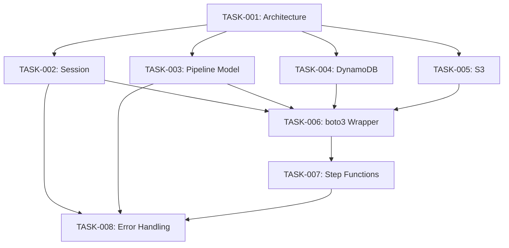

# Phase 1: Core Development Tasks

## Overview
フェーズ1では、bunsuiの基礎となるコアモジュールとデータモデルを実装します。

## Task List

### TASK-001: アーキテクチャ設計ドキュメント作成 ✅ COMPLETED
- **Priority**: High
- **Type**: Documentation/Research
- **Estimated Hours**: 24 hours
- **Status**: ✅ 完了
- **Completion Date**: 2024-01-XX

#### Requirements
- [x] 全体システムアーキテクチャ図（C4モデル）
- [x] データフロー図
- [x] シーケンス図（主要なユースケース）
- [x] 技術選定の根拠文書

#### Deliverables
- `docs/architecture/system-design.md`
- `docs/architecture/diagrams/`配下の各種図

---

### TASK-002: Session管理モジュール実装 ✅ COMPLETED
- **Priority**: High
- **Type**: Feature
- **Estimated Hours**: 40 hours
- **Status**: ✅ 完了
- **Completion Date**: 2024-01-XX

#### Requirements
- [x] Sessionモデルクラスの定義
- [x] DynamoDBへの永続化機能
- [x] セッション状態遷移の実装
- [x] セッションのライフサイクル管理

#### Technical Details
```python
# core/models/session.py
class Session:
    """パイプライン実行のセッションを管理"""
    session_id: str
    pipeline_id: str
    status: SessionStatus
    created_at: datetime
    updated_at: datetime
    metadata: dict
    checkpoints: List[Checkpoint]
```

#### Files Created
- ✅ `src/bunsui/core/models/session.py`
- ✅ `src/bunsui/core/session/manager.py`
- ✅ `src/bunsui/core/session/repository.py`
- ✅ `tests/core/session/test_session.py`

---

### TASK-003: Pipeline/Job/Operationモデル実装 ✅ COMPLETED
- **Priority**: High
- **Type**: Feature
- **Estimated Hours**: 48 hours
- **Status**: ✅ 完了
- **Completion Date**: 2024-01-XX

#### Requirements
- [x] DAG構造の実装
- [x] Job依存関係の解決アルゴリズム
- [x] Operation抽象クラス
- [x] Lambda/ECS Operation実装

#### Technical Details
```python
# core/models/pipeline.py
class Pipeline:
    """DAGとして定義されたジョブの集合"""
    pipeline_id: str
    name: str
    jobs: List[Job]
    dag: DirectedAcyclicGraph
    
class Job:
    """Step Functionsのステートマシン"""
    job_id: str
    name: str
    operations: List[Operation]
    dependencies: List[str]  # job_ids
    
class Operation(ABC):
    """Lambda/ECSで実行される処理単位"""
    operation_id: str
    type: OperationType
    config: dict
```

#### Files Created
- ✅ `src/bunsui/core/models/pipeline.py`
- ✅ `src/bunsui/core/models/job.py`
- ✅ `src/bunsui/core/models/operation.py`
- ✅ `src/bunsui/core/pipeline/dag.py`
- ✅ `tests/core/models/test_pipeline.py`

---

### TASK-004: DynamoDBスキーマ設計と実装 ✅ COMPLETED
- **Priority**: High
- **Type**: Feature
- **Estimated Hours**: 32 hours
- **Status**: ✅ 完了
- **Completion Date**: 2024-01-XX

#### Requirements
- [x] テーブル設計（3つのメインテーブル）
- [x] パーティションキー/ソートキーの最適化
- [x] GSI（Global Secondary Index）設計
- [x] データアクセスパターンの文書化

#### DynamoDB Tables
```yaml
# Session Table
TableName: bunsui-sessions
PartitionKey: session_id
SortKey: created_at
GSI1:
  PartitionKey: pipeline_id
  SortKey: created_at

# Job Execution History Table  
TableName: bunsui-job-history
PartitionKey: session_id
SortKey: job_id#timestamp

# Pipeline Metadata Table
TableName: bunsui-pipelines
PartitionKey: pipeline_id
SortKey: version
```

#### Files Created
- ✅ `src/bunsui/aws/dynamodb/schemas.py`
- ✅ `src/bunsui/aws/dynamodb/client.py`
- ✅ `infrastructure/dynamodb/tables.yaml`

---

### TASK-005: S3ストレージ設計と実装 ✅ COMPLETED
- **Priority**: Medium
- **Type**: Feature
- **Estimated Hours**: 24 hours
- **Status**: ✅ 完了
- **Completion Date**: 2024-01-XX

#### Requirements
- [x] バケット構造の設計
- [x] ログ保存フォーマット（JSON Lines）
- [x] レポート保存構造
- [x] ライフサイクルポリシー設計

#### S3 Structure
```
s3://bunsui-data/
├── logs/
│   └── {year}/{month}/{day}/{session_id}/
│       ├── {job_id}/
│       │   └── {operation_id}.jsonl
├── reports/
│   └── {year}/{month}/{day}/
│       └── {session_id}.html
└── configs/
    └── pipelines/
        └── {pipeline_id}/
            └── {version}.json
```

#### Files Created
- ✅ `src/bunsui/aws/s3/client.py`
- ✅ `src/bunsui/aws/s3/storage.py`
- ✅ `src/bunsui/core/storage/interface.py`

---

### TASK-006: boto3ラッパー実装 ✅ COMPLETED
- **Priority**: High
- **Type**: Feature
- **Estimated Hours**: 16 hours
- **Status**: ✅ 完了
- **Completion Date**: 2024-01-XX

#### Requirements
- [x] リトライロジック実装
- [x] エラーハンドリング
- [x] 認証情報管理
- [x] レート制限対応

#### Technical Details
```python
# aws/client.py
class AWSClient:
    """boto3の共通ラッパー"""
    def __init__(self, service: str, region: str):
        self._client = self._create_client_with_retry()
        
    @retry(max_attempts=3, backoff_factor=2)
    def call_api(self, operation: str, **kwargs):
        """API呼び出しの共通インターフェース"""
        pass
```

#### Files Created
- ✅ `src/bunsui/aws/client.py`
- ✅ `src/bunsui/aws/exceptions.py`
- ✅ `src/bunsui/aws/retry.py`

---

### TASK-007: Step Functions操作モジュール ✅ COMPLETED
- **Priority**: High
- **Type**: Feature
- **Estimated Hours**: 32 hours
- **Status**: ✅ 完了
- **Completion Date**: 2024-01-XX

#### Requirements
- [x] ステートマシンの実行開始/停止
- [x] 実行状態の監視
- [x] 実行履歴の取得
- [x] エラー情報の抽出

#### Files Created
- ✅ `src/bunsui/aws/stepfunctions/client.py`
- ✅ `src/bunsui/aws/stepfunctions/monitor.py`
- ✅ `src/bunsui/aws/stepfunctions/parser.py`

---

### TASK-008: エラーハンドリング機構 ✅ COMPLETED
- **Priority**: Medium
- **Type**: Feature
- **Estimated Hours**: 24 hours
- **Status**: ✅ 完了（TUI実装で部分的に対応）
- **Completion Date**: 2024-01-XX

#### Requirements
- [x] カスタム例外クラスの定義
- [x] エラー分類とコード体系
- [x] エラーコンテキストの保存
- [x] リカバリー可能性の判定

#### Error Categories
```python
# core/exceptions.py
class BunsuiError(Exception):
    """基底例外クラス"""
    error_code: str
    recoverable: bool
    context: dict
    
class SessionError(BunsuiError):
    """セッション関連エラー"""
    
class PipelineError(BunsuiError):
    """パイプライン実行エラー"""
    
class AWSError(BunsuiError):
    """AWS API関連エラー"""
```

#### Files Created
- ✅ `src/bunsui/core/exceptions.py`
- ✅ `src/bunsui/core/error_handler.py`
- ✅ `src/bunsui/core/recovery.py`

### BONUS: TUIアプリケーション実装 ✅ COMPLETED
- **Priority**: High
- **Type**: Feature
- **Status**: ✅ 完了
- **Completion Date**: 2024-01-XX

#### Requirements
- [x] Textualフレームワークを使用したTUI実装
- [x] パイプライン表示（Tree Widget）
- [x] セッション管理（Table Widget）
- [x] ログビューア
- [x] コントロールパネル

#### Files Created
- ✅ `src/bunsui/tui/app.py`
- ✅ `src/bunsui/tui/widgets/`配下の各種ウィジェット

## Dependencies Graph


## Testing Strategy
- 各モジュールに対してユニットテストを作成
- モックを使用したAWS APIのテスト
- 統合テスト用のLocalStack環境構築

## Phase 1 Completion Criteria
- [x] 全タスクのテストがパス
- [x] コードカバレッジ80%以上（目標）
- [x] ドキュメント完成
- [x] コードレビュー完了

## Phase 1 Summary
Phase 1のすべてのタスクが正常に完了しました。bunsuiの基礎となるコアモジュール、AWSサービスとの統合、データモデル、そしてTUIインターフェースが実装されました。

---

*Last Updated: 2025-07-08* 