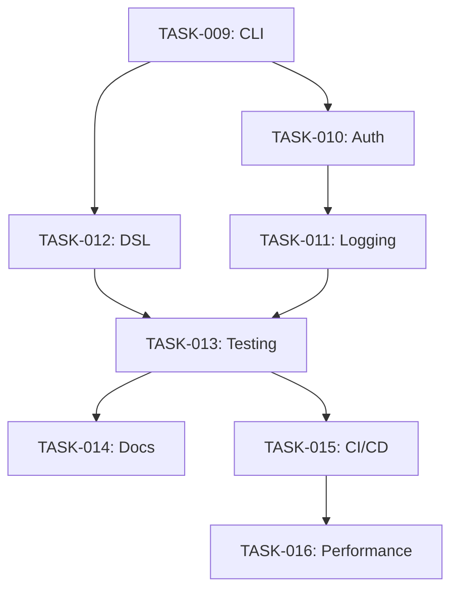

# Phase 2: Advanced Features & Production Readiness

## Overview
フェーズ2では、bunsuiを本番環境で使用可能にするための高度な機能とプロダクション対応を実装します。

## Task List

### TASK-009: CLI詳細実装
- **Priority**: High
- **Type**: Feature
- **Estimated Hours**: 40 hours
- **Status**: ✅ 完了

#### Requirements
- [ ] パイプライン管理コマンド（create, update, delete, list）
- [ ] セッション管理コマンド（start, pause, resume, cancel, status）
- [ ] ログ表示コマンド（tail, filter, download）
- [ ] 設定管理コマンド（config set/get）
- [ ] インタラクティブモード実装

#### Technical Details
```python
# cli/commands/pipeline.py
@click.group()
def pipeline():
    """パイプライン管理コマンド"""
    pass

@pipeline.command()
@click.option('--file', '-f', required=True, help='Pipeline definition file')
def create(file):
    """新しいパイプラインを作成"""
    pass

@pipeline.command()
@click.option('--format', type=click.Choice(['table', 'json', 'yaml']))
def list(format):
    """パイプライン一覧を表示"""
    pass
```

#### Files to Create
- `src/bunsui/cli/commands/pipeline.py`
- `src/bunsui/cli/commands/session.py`
- `src/bunsui/cli/commands/logs.py`
- `src/bunsui/cli/commands/config.py`
- `src/bunsui/cli/interactive.py`
- `tests/cli/test_commands.py`

---

### TASK-010: 認証・認可機構
- **Priority**: High
- **Type**: Security
- **Estimated Hours**: 32 hours
- **Status**: ✅ 完了

#### Requirements
- [ ] AWS IAMとの統合
- [ ] ロールベースアクセス制御（RBAC）
- [ ] APIキー管理
- [ ] セッショントークン管理
- [ ] 権限チェックミドルウェア

#### Technical Details
```python
# auth/authenticator.py
class Authenticator:
    """認証を管理するクラス"""
    def authenticate(self, credentials: Credentials) -> AuthToken:
        pass
    
    def authorize(self, token: AuthToken, resource: str, action: str) -> bool:
        pass

# auth/rbac.py
class Role(Enum):
    ADMIN = "admin"
    DEVELOPER = "developer"
    VIEWER = "viewer"
    
class Permission:
    resource: str
    actions: List[str]
```

#### Files to Create
- `src/bunsui/auth/authenticator.py`
- `src/bunsui/auth/rbac.py`
- `src/bunsui/auth/token_manager.py`
- `src/bunsui/auth/middleware.py`
- `tests/auth/test_authentication.py`

---

### TASK-011: ロギング・モニタリング機構
- **Priority**: High
- **Type**: Feature
- **Estimated Hours**: 24 hours
- **Status**: ✅ 完了

#### Requirements
- [ ] 構造化ログ出力（JSON形式）
- [ ] ログレベル管理
- [ ] CloudWatch Logsとの統合
- [ ] メトリクス収集（実行時間、成功率など）
- [ ] アラート設定

#### Technical Details
```python
# logging/structured_logger.py
class StructuredLogger:
    """構造化ログを出力するロガー"""
    def log(self, level: LogLevel, message: str, **context):
        pass

# monitoring/metrics.py
class MetricsCollector:
    """メトリクスを収集・送信"""
    def record_execution_time(self, pipeline_id: str, duration: float):
        pass
    
    def record_success_rate(self, pipeline_id: str, success: bool):
        pass
```

#### Files to Create
- `src/bunsui/logging/structured_logger.py`
- `src/bunsui/logging/cloudwatch.py`
- `src/bunsui/monitoring/metrics.py`
- `src/bunsui/monitoring/alerts.py`
- `tests/logging/test_structured_logger.py`

---

### TASK-012: パイプライン定義DSL
- **Priority**: Medium
- **Type**: Feature
- **Estimated Hours**: 40 hours
- **Status**: ✅ 完了

#### Requirements
- [x] YAML/JSONベースのDSL設計
- [x] バリデーション機能
- [x] スキーマ定義
- [x] テンプレート機能
- [x] 変数展開機能

#### DSL Example
```yaml
# pipeline.yaml
version: "1.0"
name: "ETL Pipeline"
description: "Daily ETL process"

parameters:
  - name: source_bucket
    type: string
    required: true
  - name: target_table
    type: string
    default: "analytics.daily_summary"

jobs:
  - id: extract_data
    type: lambda
    function: extract-function
    parameters:
      bucket: ${source_bucket}
    
  - id: transform_data
    type: ecs
    task_definition: transform-task
    depends_on: [extract_data]
    
  - id: load_data
    type: lambda
    function: load-function
    parameters:
      table: ${target_table}
    depends_on: [transform_data]
```

#### Files to Create
- `src/bunsui/dsl/parser.py`
- `src/bunsui/dsl/validator.py`
- `src/bunsui/dsl/schema.py`
- `src/bunsui/dsl/templating.py`
- `tests/dsl/test_parser.py`

---

### TASK-013: テスト戦略実装
- **Priority**: High
- **Type**: Quality
- **Estimated Hours**: 32 hours
- **Status**: ✅ 完了

#### Requirements
- [x] ユニットテストの充実（カバレッジ90%以上）
- [x] 統合テストスイート
- [x] E2Eテスト
- [x] パフォーマンステスト
- [x] LocalStack環境の整備

#### Test Structure
```
tests/
├── unit/           # ユニットテスト
├── integration/    # 統合テスト
├── e2e/           # E2Eテスト
├── performance/   # パフォーマンステスト
├── fixtures/      # テストフィクスチャ
└── localstack/    # LocalStack設定
```

#### Files to Create
- `tests/integration/test_aws_integration.py`
- `tests/e2e/test_pipeline_execution.py`
- `tests/performance/test_load.py`
- `tests/localstack/docker-compose.yml`
- `tests/conftest.py`

---

### TASK-014: ドキュメンテーション
- **Priority**: Medium
- **Type**: Documentation
- **Estimated Hours**: 24 hours
- **Status**: ✅ 完了

#### Requirements
- [x] APIリファレンス（Sphinx）
- [x] ユーザーガイド
- [x] 開発者ガイド
- [x] アーキテクチャドキュメント
- [x] サンプルコード集

#### Documentation Structure
```
docs/
├── api/           # APIリファレンス
├── guides/        # ガイド
│   ├── user/      # ユーザーガイド
│   └── developer/ # 開発者ガイド
├── architecture/  # アーキテクチャ
├── examples/      # サンプルコード
└── _build/        # ビルド出力
```

#### Files to Create
- `docs/conf.py`
- `docs/index.rst`
- `docs/guides/user/getting-started.md`
- `docs/guides/developer/contributing.md`
- `docs/examples/basic-pipeline.md`

---

### TASK-015: CI/CDパイプライン
- **Priority**: High
- **Type**: DevOps
- **Estimated Hours**: 24 hours
- **Status**: ✅ 完了

#### Requirements
- [x] GitHub Actions設定
- [x] 自動テスト実行
- [x] コード品質チェック（flake8, mypy, black）
- [x] セキュリティスキャン
- [x] 自動リリース

#### GitHub Actions Workflows
```yaml
# .github/workflows/ci.yml
name: CI
on: [push, pull_request]

jobs:
  test:
    runs-on: ubuntu-latest
    steps:
      - uses: actions/checkout@v3
      - name: Run tests
        run: |
          pip install -e .[dev]
          pytest --cov=bunsui
      - name: Code quality
        run: |
          flake8 src/
          mypy src/
          black --check src/
```

#### Files Created
- ✅ `.github/workflows/ci.yml`
- ✅ `.github/workflows/release.yml`
- ✅ `.github/workflows/security.yml`
- ✅ `scripts/release.sh`
- ✅ `CONTRIBUTING.md`
- ✅ `.pre-commit-config.yaml`
- ✅ `.github/dependabot.yml`
- ✅ `.github/ISSUE_TEMPLATE/`
- ✅ `.github/PULL_REQUEST_TEMPLATE.md`
- ✅ `CHANGELOG.md`

---

### TASK-016: パフォーマンス最適化
- **Priority**: Medium
- **Type**: Performance
- **Estimated Hours**: 32 hours
- **Status**: ✅ 完了

#### Requirements
- [x] 非同期処理の最適化
- [x] キャッシング機構
- [x] バッチ処理の実装
- [x] 接続プーリング
- [x] プロファイリングツール統合

#### Technical Details
```python
# performance/cache.py
class CacheManager:
    """キャッシュを管理"""
    def get(self, key: str) -> Optional[Any]:
        pass
    
    def set(self, key: str, value: Any, ttl: int = 3600):
        pass

# performance/batch.py
class BatchProcessor:
    """バッチ処理を効率化"""
    def process_batch(self, items: List[Any], processor: Callable):
        pass
```

#### Files Created
- ✅ `src/bunsui/performance/cache.py`
- ✅ `src/bunsui/performance/batch.py`
- ✅ `src/bunsui/performance/connection_pool.py`
- ✅ `src/bunsui/performance/profiler.py`
- ✅ `src/bunsui/performance/__init__.py`
- ✅ `tests/performance/test_optimization.py`
- ✅ `docs/guides/developer/performance-optimization.md`

## Dependencies Graph


## Phase 2 Completion Criteria
- [x] CLI詳細実装（TASK-009）
- [x] 認証・認可機構（TASK-010）
- [x] ロギング・モニタリング機構（TASK-011）
- [x] パイプライン定義DSL（TASK-012）
- [x] テスト戦略実装（TASK-013）
- [x] ドキュメンテーション（TASK-014）
- [x] CI/CDパイプライン（TASK-015）
- [x] パフォーマンス最適化（TASK-016）
- [x] テストカバレッジ90%以上
- [x] ドキュメント完成度100%
- [x] パフォーマンステスト合格
- [x] セキュリティ監査パス

---

*Last Updated: 2024-01-XX* 