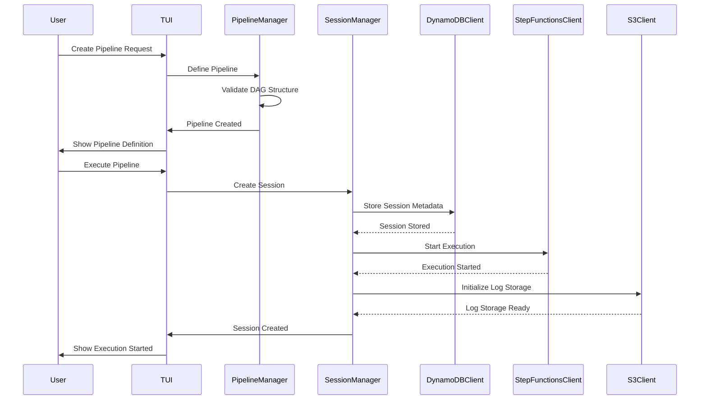
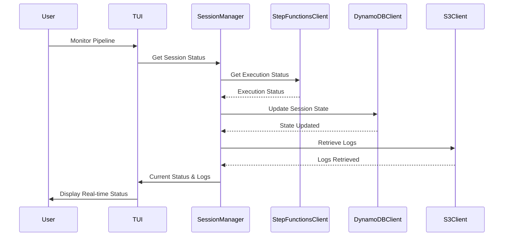
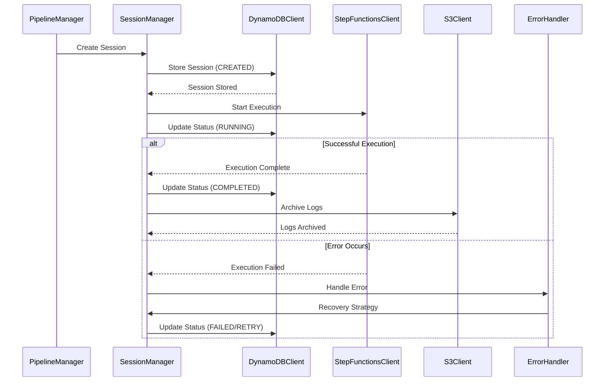
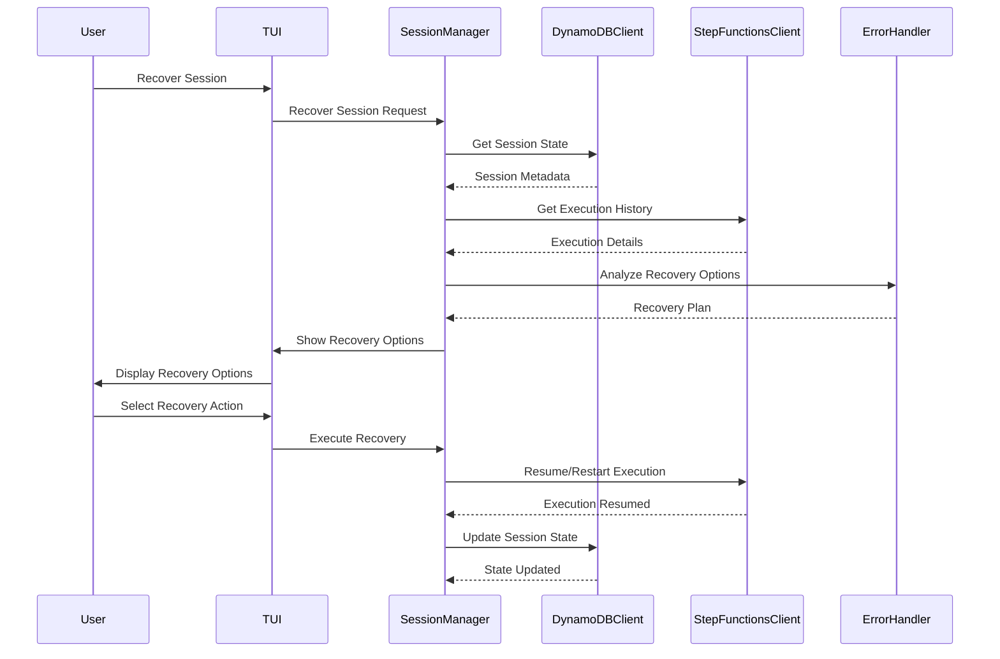
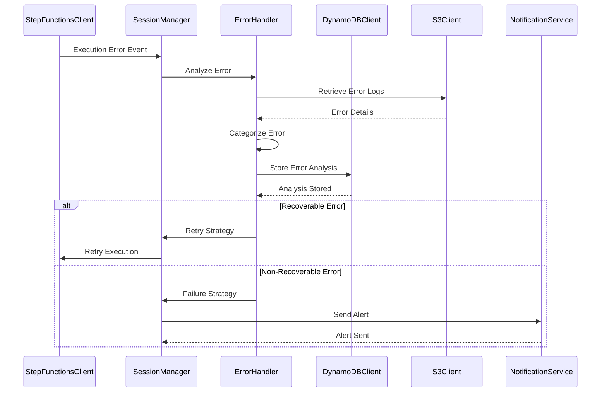
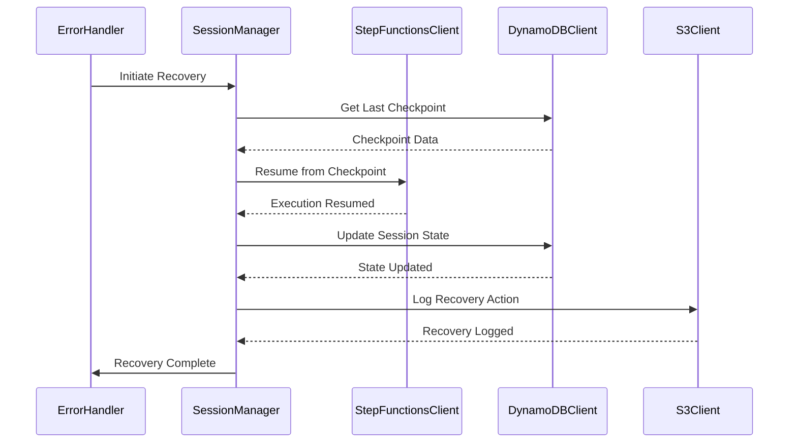
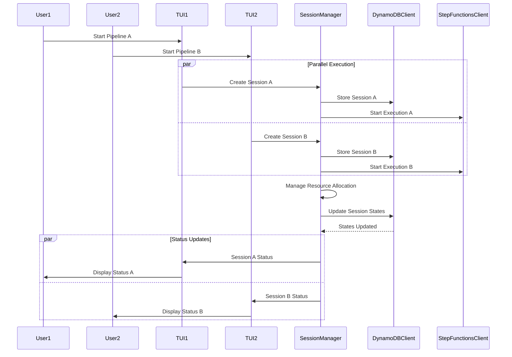
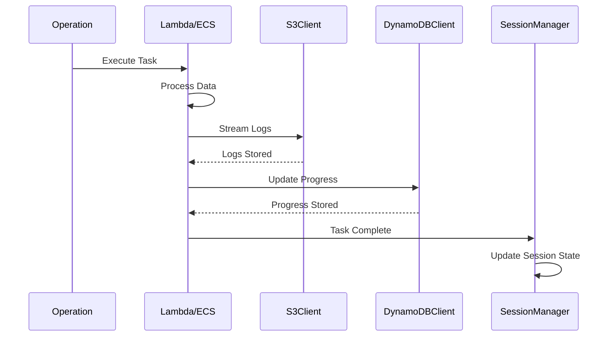
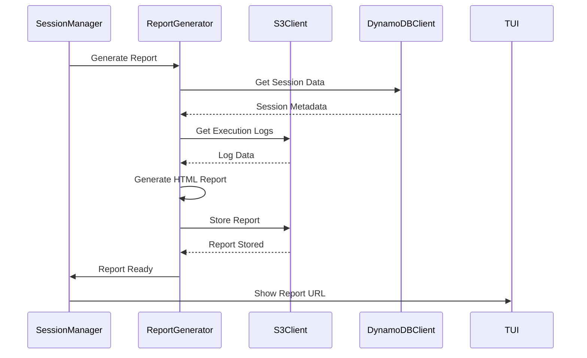
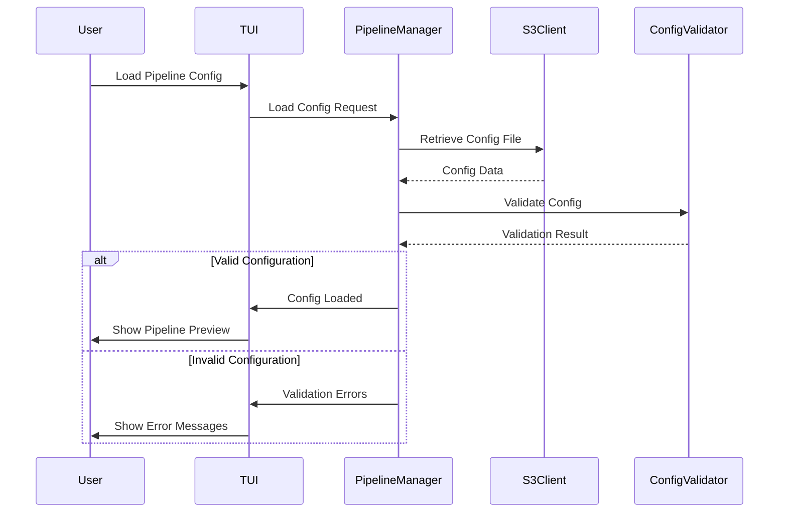

# Bunsui Sequence Diagrams

## Overview

本ドキュメントでは、Bunsuiシステムにおける主要なユースケースのシーケンス図を示します。

## 1. Pipeline Creation and Execution

### 1.1 Pipeline Definition and Execution

### 1.2 Pipeline Execution Monitoring

## 2. Session Management

### 2.1 Session Lifecycle Management

### 2.2 Session Recovery

## 3. Error Handling and Recovery

### 3.1 Error Detection and Analysis

### 3.2 Automatic Recovery Process

## 4. Multi-Session Management

### 4.1 Concurrent Session Handling

## 5. Data Flow and Storage

### 5.1 Log Processing and Storage

### 5.2 Report Generation

## 6. Configuration and Deployment

### 6.1 Pipeline Configuration Loading

---

*Document Version: 1.0*  
*Last Updated: 2024-01-XX*  
*Next Review: 2024-XX-XX* 